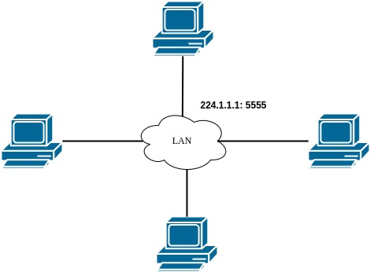

<h1 align="center" style="color: #DC143CFF">PolyUno</h1>

Le but du projet est de developer un jeu de UNO en utilisant le protocole UDP en multicast décentralisé, car il n'y a pas de serveur.

## Description du fonctionnement de l'API

## Fonctionnement du réseau

L'application fonctionne avec UDP en multicast, il n'y a donc pas réellement de serveur, tous les clients gèrent la partie en s'échangeant les informations en multicast de chaque action.

