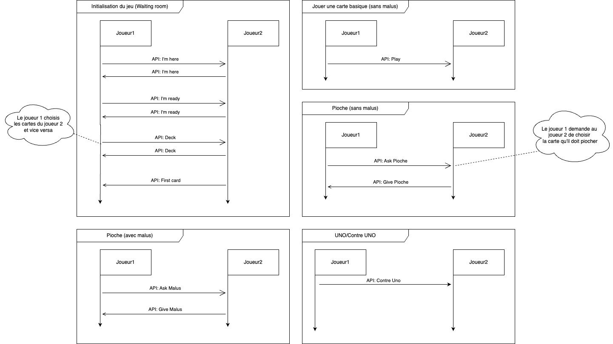

<h1 align="center" style="color: #DC143CFF">PolyUno</h1>

Le but du projet est de developer un jeu de UNO en utilisant le protocole UDP en multicast décentralisé, car il n'y a pas de serveur.

## Description du fonctionnement de l'API

## Guide d'utilisation

Lancer la version basique du jeu : 

    python3 game.py

Lancer la version debug du jeu (affichera des données relative aux intéractions et autre) :

    python3 game.py -debug

Lancer deux versions du jeu sur la même machine (dans des terminals différents ) :

    python3 game.py -debug-server

    python game.py -debug-client

## Fonctionnement du réseau

L'application fonctionne avec UDP en multicast, il n'y a donc pas réellement de serveur, tous les clients gèrent la partie en s'échangeant les informations en multicast de chaque action.

